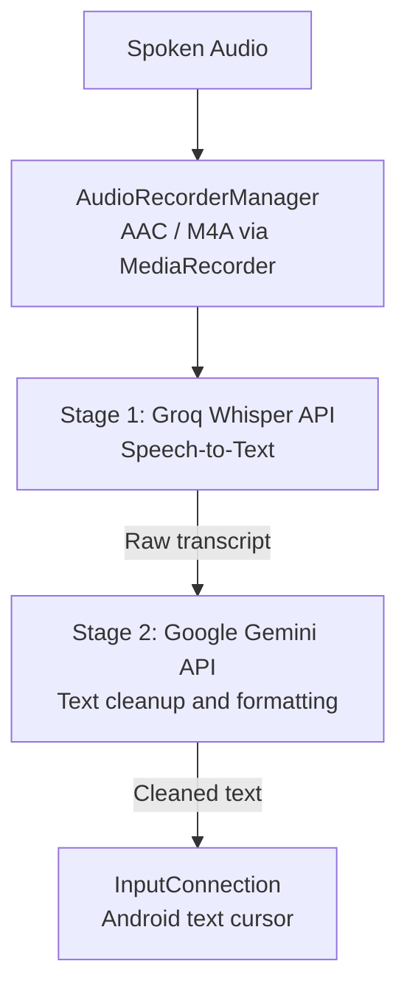

# MyTypeless

An Android voice input method (IME) designed for mixed Traditional Chinese and English speech, built with a two-stage pipeline combining Whisper for speech-to-text and Gemini for text cleanup.

---

## Why I Built This

I frequently speak using a mixture of Traditional Chinese and English, especially when talking about software, technical work, or everyday product topics. Existing mobile voice input often struggles with this kind of code-switching. English technical terms, acronyms, product names, or everyday expressions embedded inside Chinese sentences often get transcribed into phonetic Chinese characters or forcibly translated into pure Chinese.

At the same time, using standalone voice-recording apps creates too much friction. Having to open a separate app, record audio, copy the transcript, switch back to the original app, and paste the result interrupts whatever I am writing.

I wanted a simpler experience:
1. Speak naturally with mixed languages.
2. Have speech recognition accurately capture both languages.
3. Clean up filler words and formatting.
4. Insert the final text directly at the current cursor in whatever app I am using.

This project started as an effort to solve that personal frustration, and became an experiment in building a functional Android application in close collaboration with AI assistants.

---

## What It Does

MyTypeless functions as an Android system keyboard (Input Method Service) that you can invoke inside any text field:

* **In-Place Voice Dictation**: Press to speak, and the cleaned text is inserted directly into the active field (Slack, Notion, Gmail, messaging apps, or notes) via Android's `InputConnection`.
* **Bilingual Code-Switching**: Recognizes natural combinations of Traditional Chinese and English without converting English terms into Chinese.
* **Text Cleanup and Formatting**: Removes vocal fillers (such as "um", "uh", "那個"), adjusts punctuation, and adds paragraph breaks when transitioning between distinct topics or list items.
* **Bring Your Own Key (BYOK)**: Connects directly to your own Groq and Google Gemini API accounts through a built-in settings interface.

---

## How It Works

The core pipeline divides speech input and text processing into two separate stages:



1. **Audio Capture**: Android's `MediaRecorder` encodes the microphone input into an AAC audio file (`.m4a`) at 16 kHz mono.
2. **Speech Recognition**: The audio file is sent to Groq's Whisper API (`whisper-large-v3-turbo`) for transcription.
3. **Text Processing**: The raw transcript is passed to Google's Gemini API (`gemini-2.5-flash`), which removes filler words, formats punctuation, and preserves English terms.
4. **Cursor Injection**: The processed text is inserted directly at the current cursor location via the system `InputConnection`.

Separating speech recognition and text processing makes sense here because each model handles what it is best at: Whisper focuses strictly on acoustic transcription, while Gemini handles linguistic cleanup and formatting. Sending text rather than raw audio to Gemini also keeps token consumption low and avoids rate-limit bottlenecks associated with audio-capable endpoints.

---

## Design Decisions

### 1. Two-Stage AI Pipeline

Instead of using a single end-to-end multimodal model for audio understanding and formatting, the application splits the task:

* **Whisper** handles audio transcription.
* **Gemini** handles text restructuring, grammar cleanup, and punctuation.

**Trade-off**: This approach requires two sequential network requests, which introduces network overhead. However, it avoids sending larger audio payloads to an LLM, keeps LLM token usage under 100 tokens per dictation, and allows each prompt and model configuration to be adjusted independently.

### 2. Preserving Mixed Traditional Chinese and English

In real-world communication, people routinely mix languages—for example, *"我們明天要 deploy 到 staging 做 code review，下午再 sync 一下"*. Translating terms like "deploy", "staging", or "sync" into Chinese feels unnatural and loses technical precision.

Standard prompts like "keep English terms" often fail because language models tend to translate familiar words anyway. To address this, the Gemini prompt treats English words as immutable tokens that should remain unaltered, while ensuring the surrounding Chinese text uses standard Traditional Chinese (Taiwan). This avoids needing to maintain brittle domain-specific dictionaries while still allowing natural bilingual speech.

### 3. Android System-Level Input (IME)

Implementing the app as an `InputMethodService` rather than a standalone activity was essential to the desired user experience. If voice dictation requires switching apps and copying to the clipboard, the barrier to using it for short messages or quick notes remains too high.

**Trade-off**: Android input methods operate under platform constraints. For example, an `InputMethodService` window cannot directly request runtime permissions. To handle microphone access cleanly, the application uses a lightweight, transparent activity trampoline (`PermissionActivity`) that requests permission and immediately returns focus to the keyboard.

---

## Technology Stack

| Component | Implementation |
| :--- | :--- |
| **Language** | Kotlin |
| **Platform** | Android (Min SDK 28, Target SDK 34) |
| **Build System** | Gradle (Kotlin DSL) |
| **Android APIs** | `InputMethodService`, `InputConnection`, `MediaRecorder` |
| **Audio Format** | AAC 16 kHz Mono (MPEG-4 container) |
| **HTTP Client** | OkHttp 4 |
| **Speech-to-Text** | Groq Whisper API (`whisper-large-v3-turbo`) |
| **Text Processing** | Google Gemini API (`gemini-2.5-flash`) |
| **Configuration** | Android `SharedPreferences` (on-device) |

---

## Setup

### Prerequisites

* Android Studio and Android SDK (API 34)
* An Android device running Android 9.0 (API 28) or higher
* A [Groq API Key](https://console.groq.com/keys)
* A [Google Gemini API Key](https://aistudio.google.com/app/apikey)

### Building and Installing

1. **Clone the repository**:
   ```bash
   git clone https://github.com/<your-username>/MyTypeless.git
   cd MyTypeless
   ```

2. **Build the debug APK**:
   ```bash
   ./gradlew assembleDebug
   ```

3. **Install to your device**:
   ```bash
   adb install -r app/build/outputs/apk/debug/app-debug.apk
   ```

### Enabling the Keyboard

1. Go to **Settings** $\rightarrow$ **System** $\rightarrow$ **Languages & input** $\rightarrow$ **On-screen keyboard**.
2. Enable **MyTypeless**.
3. When typing in any text field, switch your active keyboard to MyTypeless.
4. Tap the **Settings** icon on the keyboard view to enter your Groq and Gemini API keys, then save.

---

## Privacy

* **Direct API Communication**: The app communicates directly with Groq and Google Gemini API endpoints over HTTPS. There are no intermediate servers, proxy relays, or telemetry services operated by this project.
* **Local Storage**: API keys and user preferences are stored locally on your device in Android's private `SharedPreferences`, accessible only to this application.
* **Data in Transit**: Spoken audio is sent to Groq for speech-to-text transcription. The transcribed text is sent to Google Gemini for cleanup and formatting. Data transmission is subject to the respective privacy policies and terms of service of Groq and Google.

---

## Limitations and Future Improvements

* **Network Dependency**: The application currently relies entirely on cloud APIs and requires an active internet connection. Offline transcription is not supported.
* **Sequential Latency**: Because the two stages run sequentially, total processing time depends on network latency and external API responsiveness.
* **Input Features**: The keyboard focuses on voice input and includes basic controls (such as backspace), but does not aim to be a full alphanumeric keyboard replacement.
* **Prompt Customization**: Prompt rules for text formatting are currently built into the app; allowing customizable prompts or formatting styles is a possible future addition.

---

## Development Approach

This project was built through close collaboration with AI assistants. 

Rather than treating AI as an automatic code generator, I used it as an interactive engineering partner throughout the development cycle:
* Exploring Android `InputMethodService` lifecycles and permission workarounds.
* Setting up and refining audio recording configurations with `MediaRecorder`.
* Structuring the OkHttp client logic for both API integrations.
* Iterating on prompt constraints to balance bilingual preservation and sentence formatting.
* Debugging runtime issues and refactoring code.

My role was defining the product requirements, evaluating the user experience on physical hardware, identifying edge cases in mixed-language speech, and making the trade-offs on architecture and implementation.

---

## License

This project is licensed under the [MIT License](LICENSE).
